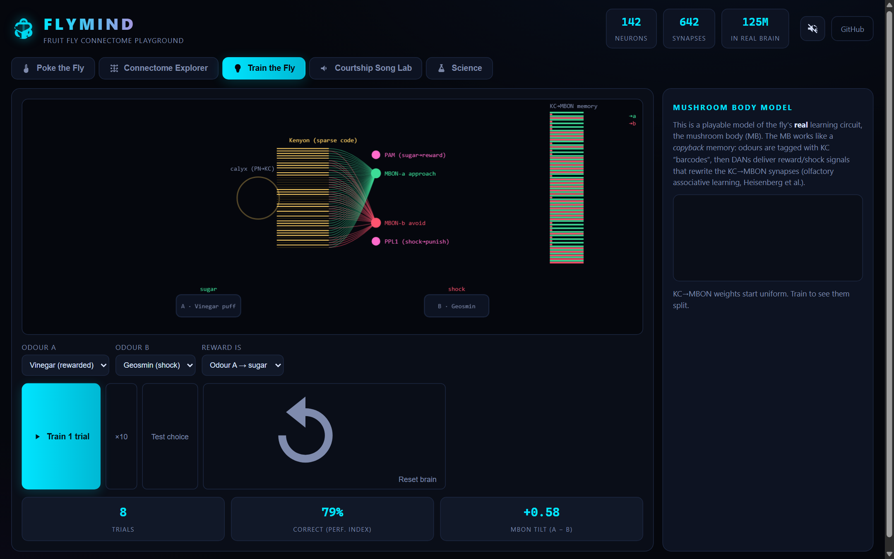
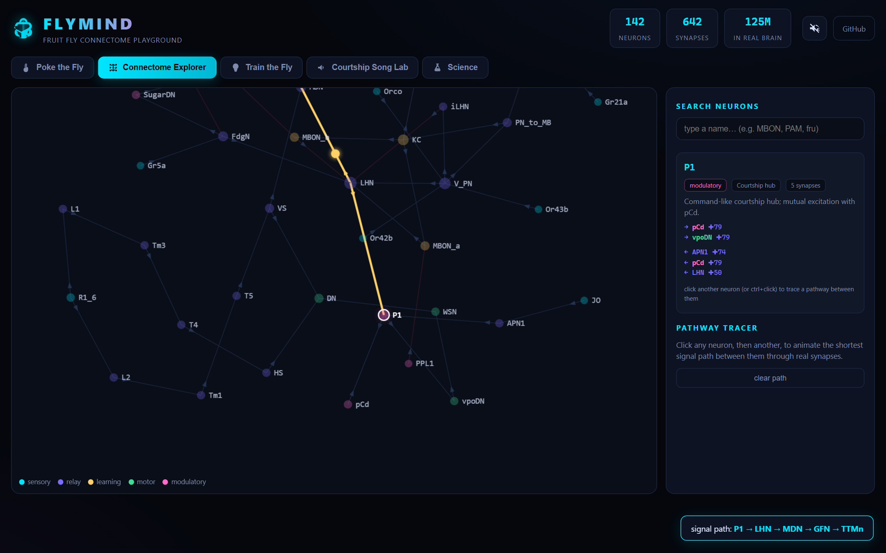
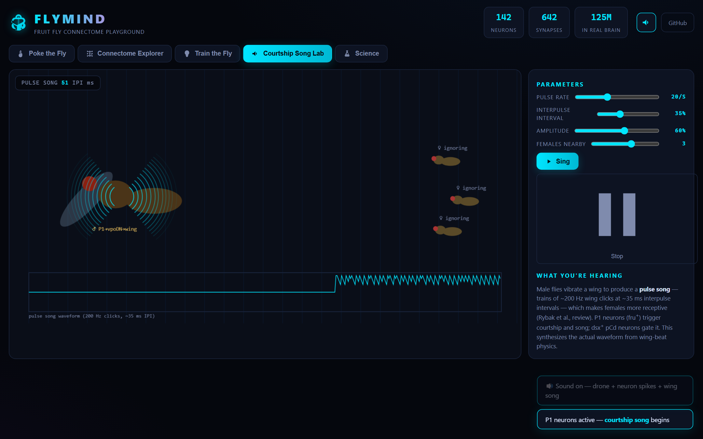
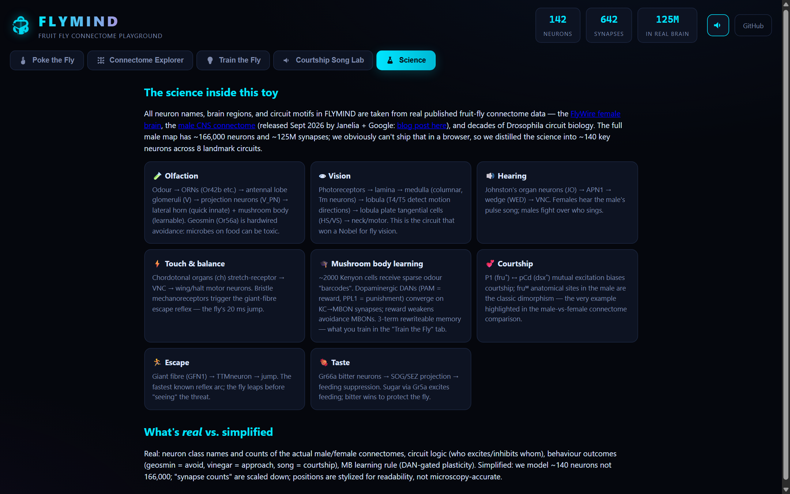

# 🧠 FLYMIND — Interactive Fruit Fly Connectome Playground

**Poke a fruit fly's senses. Watch real neural circuits light up. Train its brain. Listen to it sing.**


A neon-wireframe fly under a lab scanner: poke its senses, and real named neurons fire across its brain in cascades — with live oscilloscope, circuit trace, and sound. Built on the complete fruit fly connectomes — the [FlyWire female brain](https://flywire.ai) and the [male CNS connectome](https://male-cns.janelia.org/) (166,000 neurons, 125M synapses) published by HHMI Janelia + Google Research ([blog post](https://research.google/blog/a-connectomics-milestone-mapping-the-complete-male-fruit-fly-brain/)).

> Everyone built chess bots and sudoku solvers on connectomes. This one is different — it's a **living lab pet**: an interactive fly whose neurons actually fire, learn, and sing, using the real circuit motifs from published Drosophila connectomics.

## 🎮 What you can do

| Tab | Play |
|---|---|
| **🪰 Poke the Fly** | Click the dashed hotspots — SMELL, SEE, TOUCH, SCARE — or the fly itself. Signals cascade through named neurons (Or42b → V_PN → KC → MBON…) with live oscilloscope + circuit trace. Geosmin? It flees. Vinegar? It approaches. Poke it? Giant-fibre jump reflex. |
| **🕸 Connectome Explorer** | A force-graph of 42 real neuron classes. Drag, zoom, search (`MBON`, `PAM`, `fru`). Click neurons for their real synapses; click two to animate the shortest signal path between them (BFS over the wiring). |
| **🎓 Train the Fly** | A playable **mushroom body** — the fly's actual learning circuit. Pick two odours, train sugar/shock pairings, and watch KC→MBON synapse weights rewrite (dopamine-gated depression, like the real MB). Then run a free-choice test and see which way the fly walks. |
| **🎵 Courtship Song Lab** | Males vibrate a wing to sing a ~200 Hz **pulse song** (~35 ms interpulse interval). Sliders control pulse rate/IPI/amplitude — real WebAudio synthesis — and females on-screen become receptive when they "hear" it (P1 → vpoDN → wing motor). |
| **🔬 Science** | Every circuit in the app explained, with the real papers behind them, plus an honest "what's real vs simplified" table. |





**Pro tip:** hit the speaker (top-right) — an ambient lab drone swells with brain activity, every firing neuron pings a pitch-blip keyed to its cell class, and the courtship song is a layered synthesis of real wing-beat physics (fundamental + harmonic + noise transient).





## 🚀 Run it

No build. No dependencies to run — just static files. (npm is only for the dev/test tooling.)

```bash
npm start          # serve on http://localhost:8123
# or any static server works
npx serve .
python -m http.server 8000
```

## 🌐 Deploy to GitHub Pages

1. Create a new GitHub repo (e.g. `flymind`)
2. Push these files:

```bash
git init
git add .
git commit -m "FLYMIND: interactive fruit fly connectome playground"
git branch -M main
git remote add origin https://github.com/<you>/flymind.git
git push -u origin main
```

3. **Settings → Pages → Source: `main` / root** → Save
4. Live at `https://<you>.github.io/flymind/` in ~1 minute.

Also deploys as-is to Netlify (drag the folder), Vercel, or Cloudflare Pages.

## 🧬 What's real vs simplified

Honest science, clearly labeled in the app's **Science** tab:

**Real (from published connectomes & circuit literature):**
- Neuron classes and names: ORNs (Or42b, Or56a, Gr21a…), projection neurons, Kenyon cells, MBONs, DANs (PAM/PPL1), APL, T4/T5 motion detectors, HS/VS tangential cells, giant fibre, P1/pCd courtship neurons, Johnston's organ → APN1, Gr5a/Gr66a taste…
- Circuit logic: who excites/inhibits whom — e.g. P1↔pCd mutual excitation, APL feedback inhibition for sparse KC codes, dopamine compartment rules (PAM = reward, PPL1 = punishment)
- Behaviour outcomes: geosmin = hardwired avoidance (it means microbes), vinegar = approach, bitter Gr66a = suppress feeding
- The MB learning rule: reward-modulated depression of active KC→MBON synapses (Owald & Waddell; Heisenberg)
- Courtship song: ~200 Hz pulses, ~35 ms IPI (Rybak et al.), P1 → vpoDN → wing path

**Simplified (for the browser):**
- ~42 neurons here vs 166,000 in the real male map (125M synapses vs ~60 here)
- Region positions are stylized for readability, not microscopy coordinates
- Firing dynamics are toy event-propagation, not biophysical Hodgkin-Huxley
- The MB shows 42 KCs, not the real ~2,000

## 📁 Files

```
flymind/
├── index.html        # single-page app shell
├── css/style.css     # neon-lab theme
├── js/
│   ├── data.js       # neurons, synapses, circuits (the science)
│   ├── brain.js      # event-driven firing engine
│   ├── arena.js      # interactive fly canvas
│   ├── explore.js    # force-graph connectome explorer
│   ├── learn.js      # mushroom body learning model
│   ├── song.js       # courtship song lab canvas
│   ├── audio.js      # WebAudio spikes + pulse-song synth
│   └── main.js       # wiring: tabs, scope, trace, toasts
└── tools/            # headless tests + browser playthrough audit
```

## 🧪 Test

All of these are **actually run and passing** — the app was played by a headless browser before shipping:

```bash
npm test                              # 4 headless suites: learning, cascades, connectivity, integrity
node tools/test-mb.js                 # learning rule: sugar flips odour valence 0.00 → +0.46
node tools/test-cascade.js            # cascades fire the right neurons in order & terminate
node tools/test-connectivity.js       # all 1600 neuron pairs reachable via real synapses
node tools/test-integration.js        # DOM ids, synapse integrity, no infinite loops
```

**Full playthrough audit** (needs Chrome + `npm install`):

```bash
chrome --headless --remote-debugging-port=9222 &
npm run audit    # → 21/21 gameplay + pixel checks passed, 0 console errors
node tools/audio-perf-audit.cjs  # → 8/8: real WebAudio output (RMS-measured), queue drains, DOM capped, 3 MB heap
```

## 📚 Sources

- [A connectomics milestone: mapping the complete male fruit fly brain](https://research.google/blog/a-connectomics-milestone-mapping-the-complete-male-fruit-fly-brain/) — Google Research, Sept 2026
- [Male CNS connectome](https://male-cns.janelia.org/) · Paper: *Sexual dimorphism in the complete connectome of the Drosophila male CNS*, Cell 2026
- [FlyWire female connectome](https://flywire.ai) · Nature 2024/2026
- Owald & Waddell — *Dopaminergic memories in mushroom bodies* (learning rule)
- Rybak et al. — *Drosophila courtship song* (pulse song parameters)
- Takemura, Chklovskii et al. — visual circuit connectomes (T4/T5, HS/VS)

## License

MIT — see [LICENSE](LICENSE). Neuron data distilled from published open connectomes; this is an educational visualization, not a research tool.
